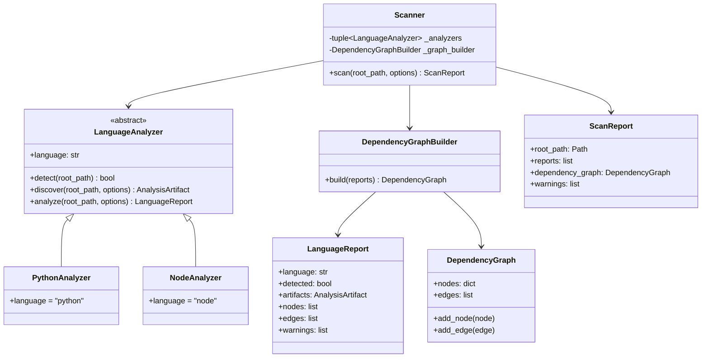
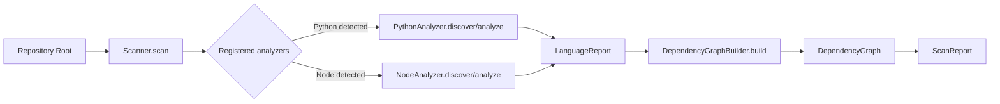

# Core Architecture

## Goals

- Keep repository inspection strictly read-only.
- Support language-specific analysis through a shared contract.
- Build a single dependency graph that can power health checks and future reporters.

## Module Boundaries

| Module | Responsibility | Allowed Dependencies | Forbidden Responsibilities |
| --- | --- | --- | --- |
| `src/core/scanner.py` | Orchestrate scan lifecycle and aggregate warnings | Analyzer contracts, graph builder, models | Language-specific parsing |
| `src/core/analyzers/base.py` | Define the `LanguageAnalyzer` abstraction | Core models | Graph aggregation, orchestration |
| `src/core/analyzers/python.py` | Inspect Python manifests and imports | Python stdlib (`ast`, `tomllib`) | Node.js parsing, write operations |
| `src/core/analyzers/node.py` | Inspect Node.js/TypeScript manifests and imports | Python stdlib (`json`, `re`) | Python parsing, write operations |
| `src/core/dependency_graph.py` | Merge analyzer results into a repository graph | Core models | File discovery or manifest parsing |
| `src/core/models.py` | Shared immutable data contracts | None | Business rules or I/O orchestration |

## Directory Structure

```text
src/
  __init__.py
  core/
    __init__.py
    models.py
    dependency_graph.py
    scanner.py
    analyzers/
      __init__.py
      base.py
      python.py
      node.py
docs/
  architecture.md
```

## Class Diagram



## Data Flow



## Scanner Lifecycle

1. `Scanner` receives the repository root and immutable `ScanOptions`.
2. Each registered analyzer decides whether it applies by discovering manifests and source files.
3. Analyzers parse manifests and source files in read-only mode, producing `LanguageReport`.
4. `DependencyGraphBuilder` merges nodes and edges into a repository-wide `DependencyGraph`.
5. `Scanner` returns a `ScanReport` for downstream health checks, reporters, or reviewers.

## Read-Only Guarantees

- Analyzers only use filesystem reads via `Path.read_text()` and directory traversal.
- No subprocess execution is required for dependency discovery.
- Dependency graph construction works exclusively on in-memory data structures.

## Extension Strategy

- New languages implement the `LanguageAnalyzer` contract and register with `Scanner`.
- The graph builder remains language-agnostic as long as analyzers emit normalized nodes and edges.
- Future health rules can consume `ScanReport` without coupling to manifest parsing details.
